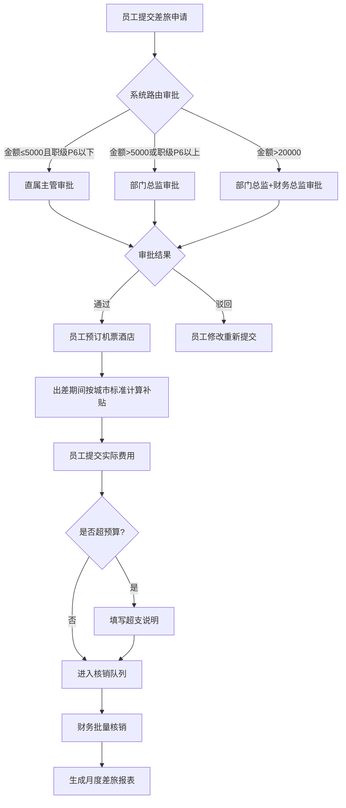

## 1. 产品概述

企业差旅申请与管理系统，面向中大型企业员工、审批人和财务人员，实现从差旅申请、审批、预订、补贴计算到费用核销的全流程数字化管理，解决传统差旅流程中申请分散、审批低效、费用不透明的问题，目标提升差旅管理效率30%以上并实现费用支出结构可视化。

## 2. 核心功能

### 2.1 用户角色

| 角色 | 进入方式 | 核心权限 |
|------|----------|----------|
| 普通员工 | 系统账号登录 | 提交差旅申请、预订机票酒店、提交实际费用、查看个人差旅记录 |
| 部门主管 | 系统账号登录+主管标识 | 审批下属差旅申请、查看部门差旅统计 |
| 财务人员 | 系统账号登录+财务标识 | 批量核销差旅费用、生成费用报表、按维度分析支出 |
| 系统管理员 | 系统账号登录+管理员标识 | 管理审批路由规则、城市补贴标准、差旅平台配置 |

### 2.2 功能模块

1. **工作台首页**：待办事项汇总、差旅数据概览、快捷操作入口
2. **差旅申请页**：申请表单填写、申请列表管理、申请详情查看
3. **审批中心页**：待审批列表、审批操作、审批记录
4. **预订中心页**：机票搜索预订、酒店搜索预订、预订记录关联
5. **费用报销页**：实际费用提交、超预算说明、补贴明细查看
6. **财务核销页**：批量核销操作、核销状态跟踪
7. **数据分析页**：月度差旅报表、部门维度分析、目的地维度分析

### 2.3 页面详情

| 页面名称 | 模块名称 | 功能描述 |
|----------|----------|----------|
| 工作台首页 | 数据概览卡片 | 展示本月差旅总费用、待审批数、进行中出差数、超预算申请数 |
| 工作台首页 | 待办事项列表 | 按紧急程度展示待审批、待提交费用、待核销等事项 |
| 工作台首页 | 快捷操作区 | 快速发起申请、快速预订、查看我的申请等入口 |
| 差旅申请页 | 新建申请表单 | 填写目的地城市、出行日期（起止）、行程目的、预估费用明细（交通/住宿/餐饮/其他） |
| 差旅申请页 | 申请列表 | 按状态筛选（草稿/审批中/已通过/已驳回/已取消），支持搜索和排序 |
| 差旅申请页 | 申请详情 | 查看申请信息、审批流程、关联预订、费用记录、补贴明细 |
| 审批中心页 | 待审批列表 | 展示待我审批的申请，按金额和紧急程度排序 |
| 审批中心页 | 审批操作面板 | 同意/驳回/转审，填写审批意见，查看申请详情和申请人信息 |
| 审批中心页 | 审批记录 | 我已审批的历史记录，按时间倒序展示 |
| 预订中心页 | 机票搜索 | 出发地/目的地/日期搜索航班，展示航班列表和价格 |
| 预订中心页 | 酒店搜索 | 目的地/入住日期/退房日期搜索酒店，展示房型和价格 |
| 预订中心页 | 预订记录 | 已预订的机票和酒店列表，自动关联到差旅申请单 |
| 费用报销页 | 费用提交表单 | 选择关联申请单，填写实际交通/住宿/餐饮/其他费用，上传发票附件 |
| 费用报销页 | 超预算说明 | 实际费用超出预估时，必须填写超支原因和说明 |
| 费用报销页 | 补贴明细 | 按目的地城市标准自动计算每日补贴，展示补贴天数和总额 |
| 费用报销页 | 报销列表 | 已提交费用列表，按状态筛选（待核销/已核销/已退回） |
| 财务核销页 | 核销工作台 | 批量选择申请单进行核销，支持按部门/日期范围筛选 |
| 财务核销页 | 核销详情 | 单笔申请的费用明细、补贴明细、超预算说明，确认核销 |
| 数据分析页 | 月度费用报表 | 按月展示差旅总费用、同比环比变化、费用构成饼图 |
| 数据分析页 | 部门维度分析 | 各部门差旅费用排行、人均差旅费用、费用趋势折线图 |
| 数据分析页 | 目的地维度分析 | 热门出差城市排行、各城市平均费用、费用结构堆叠柱状图 |

## 3. 核心流程

员工提交差旅申请后，系统根据申请金额和员工职级自动匹配审批路由规则，将申请发送至对应审批人。审批人可通过或驳回，通过后员工可在预订中心搜索并预订机票和酒店，预订记录自动关联到申请单。出差期间系统按目的地城市标准自动计算每日补贴。回程后员工提交实际发生费用，超预算部分需额外说明。财务人员按申请单批量核销，系统自动生成月度差旅费用报表。

## 4. 用户界面设计

### 4.1 设计风格

- **主色调**：深蓝色(#1B2A4A)代表专业与信赖，辅以暖橙色(#E8763A)作为强调色传达行动力
- **次色调**：浅灰蓝(#F0F4F8)背景、白色卡片、绿色(#2ECC71)通过/完成状态、红色(#E74C3C)驳回/超预算状态
- **按钮风格**：圆角8px，主按钮为深蓝底白字，次按钮为白底蓝边，操作按钮带微阴影
- **字体**：标题使用 Noto Sans SC Bold，正文使用 Noto Sans SC Regular，数据展示使用 DM Mono 等宽字体
- **布局风格**：左侧固定导航栏 + 右侧内容区，卡片式布局，表格数据区使用斑马纹
- **图标风格**：线性图标，2px描边，与文字同色系

### 4.2 页面设计概览

| 页面名称 | 模块名称 | UI 元素 |
|----------|----------|---------|
| 工作台首页 | 数据概览卡片 | 4列网格卡片，深蓝渐变背景，DM Mono大字数字，右上角小图标 |
| 工作台首页 | 待办事项列表 | 白色卡片内列表项，左侧彩色圆点标识类型，右侧操作按钮 |
| 差旅申请页 | 新建申请表单 | 分步表单(3步)，顶部步骤指示器，表单分组卡片，底部固定操作栏 |
| 差旅申请页 | 申请列表 | 表格布局，状态标签彩色胶囊，行hover阴影，顶部筛选栏 |
| 审批中心页 | 审批操作面板 | 右侧滑出抽屉，申请详情+审批意见输入+操作按钮组 |
| 预订中心页 | 搜索面板 | 顶部搜索栏(目的地/日期选择器)，下方结果卡片列表 |
| 预订中心页 | 预订卡片 | 航班信息卡片(航空公司logo+时间+价格)，酒店卡片(图片+星级+价格) |
| 费用报销页 | 费用提交表单 | 可增减的费用明细行，上传发票拖拽区，补贴自动计算面板 |
| 财务核销页 | 核销工作台 | 批量勾选表格，底部悬浮操作栏显示已选数量和核销按钮 |
| 数据分析页 | 图表区域 | 月度趋势折线图、部门柱状图、城市堆叠图、费用构成环形图 |

### 4.3 响应式设计

桌面优先设计，最小支持1280px宽度。导航栏在1024px以下折叠为汉堡菜单，表格在768px以下转为卡片列表。数据分析页的图表在小屏幕下垂直堆叠。

### 4.4 3D 场景指引

不适用
