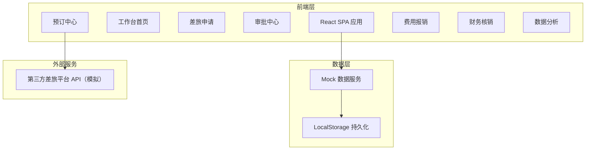
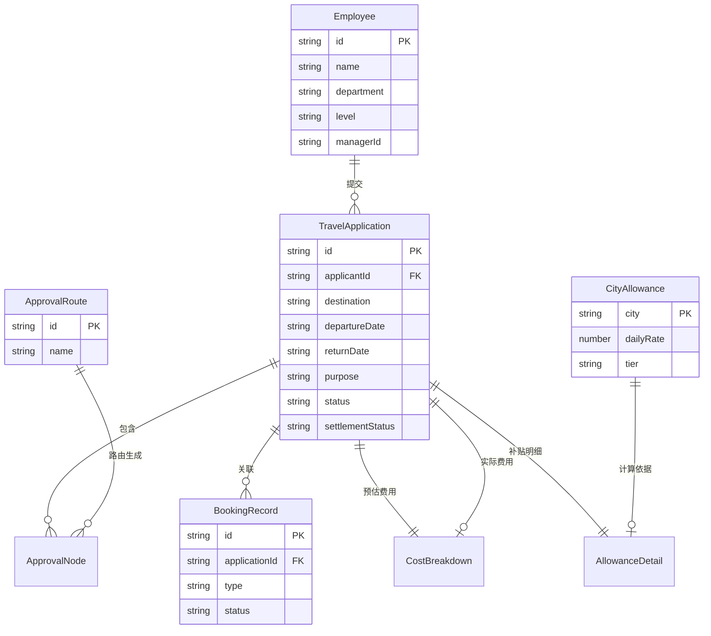

## 1. 架构设计



## 2. 技术说明

- **前端**：React@18 + Tailwind CSS@3 + Vite
- **初始化工具**：Vite
- **后端**：无后端，使用 Mock 数据模拟所有接口
- **数据库**：LocalStorage 持久化存储，内存状态管理
- **图表库**：Recharts（数据分析页可视化）
- **日期处理**：date-fns
- **路由**：React Router v6
- **状态管理**：React Context + useReducer

## 3. 路由定义

| 路由 | 用途 |
|------|------|
| `/` | 工作台首页，数据概览和待办事项 |
| `/applications` | 差旅申请列表 |
| `/applications/new` | 新建差旅申请 |
| `/applications/:id` | 申请详情 |
| `/approvals` | 审批中心，待审批和已审批列表 |
| `/bookings` | 预订中心，机票和酒店搜索预订 |
| `/expenses` | 费用报销，提交实际费用 |
| `/expenses/:id` | 费用详情和补贴明细 |
| `/settlements` | 财务核销工作台 |
| `/analytics` | 数据分析，月度报表和维度分析 |

## 4. API 定义

### 4.1 差旅申请

```typescript
interface TravelApplication {
  id: string
  applicantId: string
  applicantName: string
  department: string
  level: string
  destination: string
  departureDate: string
  returnDate: string
  purpose: string
  estimatedCosts: CostBreakdown
  status: 'draft' | 'pending' | 'approved' | 'rejected' | 'cancelled'
  approvalFlow: ApprovalNode[]
  bookings: BookingRecord[]
  actualExpenses: CostBreakdown | null
  overBudgetNote: string | null
  dailyAllowance: AllowanceDetail
  settlementStatus: 'unsettled' | 'settled' | 'returned'
  createdAt: string
  updatedAt: string
}

interface CostBreakdown {
  transportation: number
  accommodation: number
  meals: number
  other: number
  total: number
}

interface ApprovalNode {
  approverId: string
  approverName: string
  role: string
  status: 'pending' | 'approved' | 'rejected'
  comment: string
  timestamp: string
}

interface BookingRecord {
  id: string
  type: 'flight' | 'hotel'
  applicationId: string
  details: FlightDetail | HotelDetail
  status: 'confirmed' | 'cancelled'
  bookedAt: string
}

interface FlightDetail {
  airline: string
  flightNo: string
  departure: string
  arrival: string
  departureTime: string
  arrivalTime: string
  price: number
}

interface HotelDetail {
  hotelName: string
  roomType: string
  checkIn: string
  checkOut: string
  price: number
  nights: number
}

interface AllowanceDetail {
  city: string
  dailyRate: number
  days: number
  total: number
}
```

### 4.2 审批路由规则

```typescript
interface ApprovalRoute {
  id: string
  name: string
  conditions: {
    maxAmount?: number
    minLevel?: string
  }
  approvers: string[]
}

const DEFAULT_ROUTES: ApprovalRoute[] = [
  { id: 'r1', name: '低金额常规审批', conditions: { maxAmount: 5000 }, approvers: ['direct_manager'] },
  { id: 'r2', name: '中金额主管审批', conditions: { minLevel: 'P6' }, approvers: ['department_director'] },
  { id: 'r3', name: '高金额联合审批', conditions: { maxAmount: 20000 }, approvers: ['department_director', 'finance_director'] },
]
```

### 4.3 城市补贴标准

```typescript
interface CityAllowance {
  city: string
  dailyRate: number
  tier: 'first' | 'second' | 'third'
}

const CITY_ALLOWANCES: CityAllowance[] = [
  { city: '北京', dailyRate: 500, tier: 'first' },
  { city: '上海', dailyRate: 500, tier: 'first' },
  { city: '广州', dailyRate: 450, tier: 'first' },
  { city: '深圳', dailyRate: 450, tier: 'first' },
  { city: '杭州', dailyRate: 400, tier: 'second' },
  { city: '成都', dailyRate: 350, tier: 'second' },
  { city: '武汉', dailyRate: 300, tier: 'second' },
  { city: '西安', dailyRate: 280, tier: 'third' },
  { city: '长沙', dailyRate: 260, tier: 'third' },
]
```

## 5. 服务器架构图

不适用（无后端，纯前端应用）

## 6. 数据模型

### 6.1 数据模型定义



### 6.2 数据定义语言

使用 LocalStorage 存储，初始化数据通过 Mock 函数生成：

- `travel_applications`：差旅申请列表
- `employees`：员工信息
- `approval_routes`：审批路由规则
- `city_allowances`：城市补贴标准
- `booking_records`：预订记录
